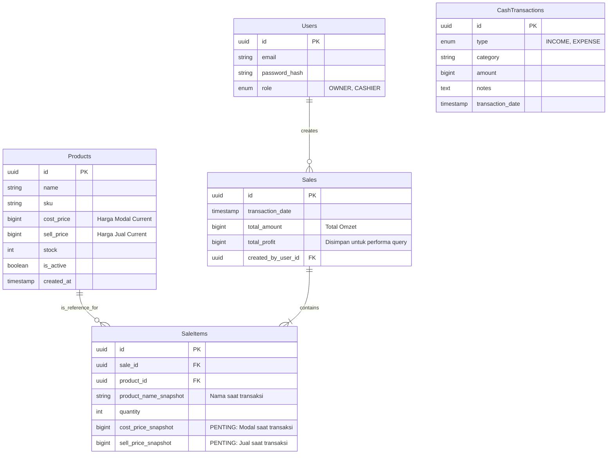

Berikut adalah **Technical Design Document (TDD)** yang komprehensif untuk Web App Keuangan Bisnis. Dokumen ini menerjemahkan kebutuhan bisnis (PRD) menjadi spesifikasi teknis mendalam yang siap dikoding oleh developer.

---

# Technical Design Document (TDD)

**Project Name:** Business Finance & POS App
**Version:** 1.0
**Date:** 12 Januari 2026
**Architecture Style:** Monorepo (pnpm workspaces)
**Backend Pattern:** Layered Architecture (Controller-Service-Repository)

---

## 1. High-Level Architecture

Sistem akan dibangun menggunakan struktur **Monorepo** untuk memudahkan sharing types (DTO) antara Frontend dan Backend.

### 1.1 Diagram Arsitektur

```mermaid
graph TD
    User((User)) -->|HTTPS| FE[Frontend Next.js]
    FE -->|REST API / JSON| BE[Backend Node.js]
    
    subgraph "Frontend Layer (apps/web)"
        UI[UI Components (shadcn)]
        RQ[React Query (Data Fetching)]
        Zustand[Zustand (Cart State)]
    end

    subgraph "Backend Layer (apps/api)"
        Controller[Controllers]
        Service[Services (Business Logic)]
        Repo[Repositories (DB Access)]
        Prisma[Prisma ORM]
    end

    subgraph "Data Layer"
        DB[(PostgreSQL)]
    end

    FE -- "Shared Types" --> BE

```

### 1.2 Tech Stack Implementation Strategy

* **Monorepo Manager:** `pnpm` (efisien dalam disk space & instalasi).
* **Backend Framework:** `Express.js` (Stable/Mature) atau `Fastify` (High Performance). *Rekomendasi: Express untuk kemudahan development speed.*
* **Validation:** `Zod` (digunakan di Frontend untuk Form & Backend untuk API Request Validation).
* **Database Interface:** `Prisma ORM` (Type-safe database queries).

---

## 2. Database Schema Design (ERD)

Desain database ini berfokus pada **Data Integrity** dan **Historical Accuracy** (Snapshot Pricing).

### 2.1 Entity Relationship Diagram



### 2.2 Penjelasan Kunci Data Model

1. **BigInt untuk Uang:** Hindari `Float` atau `Decimal` yang berpotensi memiliki masalah presisi floating point. Gunakan `BigInt` (menyimpan nilai rupiah penuh) atau integer satuan terkecil. Di TypeScript, ini perlu handling khusus saat serialisasi JSON (BigInt to String/Number).
2. **Snapshotting (`SaleItems`):** Kolom `cost_price_snapshot` dan `sell_price_snapshot` bersifat **Immutable**. Jika user mengubah harga master produk di masa depan, laporan laba rugi transaksi masa lalu **tidak boleh berubah**.

---

## 3. Backend Implementation Details

### 3.1 Folder Structure (`apps/api`)

```text
src/
  ├── config/         # Env vars, DB connection
  ├── controllers/    # Request handling, validation, response formatting
  ├── services/       # Business logic (Kalkulasi laba, cek stok)
  ├── repositories/   # Direct DB queries (Prisma calls)
  ├── middlewares/    # Auth check, Error handling
  ├── utils/          # Helper functions (Currency formatter)
  ├── routes/         # Express routes definition
  └── app.ts          # Entry point

```

### 3.2 Key Business Logic: Create Transaction Flow

**Service Method:** `SalesService.createSale(payload)`

1. **Input:** Array of `{ productId, quantity }`.
2. **Process:**
* Start Database Transaction (`prisma.$transaction`).
* Fetch semua produk terkait dari DB untuk mendapatkan harga *current*.
* Loop items:
* Cek ketersediaan stok (jika stok < request, throw Error).
* Hitung `subtotal` = `current_sell_price` * `qty`.
* Hitung `profit_item` = (`current_sell_price` - `current_cost_price`) * `qty`.
* Siapkan object `SaleItem` dengan data snapshot.


* Kurangi stok di tabel `Product`.
* Insert ke tabel `Sales` (Header) dan `SaleItems` (Detail).
* Commit Transaction.


3. **Output:** Detail transaksi yang baru dibuat.

### 3.3 API Endpoints Specification

| Method | Endpoint | Description | Request Body (Zod Schema) |
| --- | --- | --- | --- |
| **POST** | `/auth/login` | Login user | `{ email, password }` |
| **GET** | `/products` | List produk | Query: `page`, `search` |
| **POST** | `/products` | Buat produk | `{ name, cost_price, sell_price, stock }` |
| **POST** | `/sales` | **Transaksi Kasir** | `{ items: [{ productId, qty }] }` |
| **GET** | `/analytics` | Dashboard | Query: `startDate`, `endDate` |
| **POST** | `/finance` | Catat Biaya/Pemasukan | `{ type, amount, category, date }` |

---

## 4. Frontend Implementation Details

### 4.1 Folder Structure (`apps/web` - Next.js App Router)

```text
src/
  ├── app/
  │   ├── (auth)/login/page.tsx
  │   ├── (dashboard)/
  │   │   ├── layout.tsx       # Sidebar & Header
  │   │   ├── pos/page.tsx     # Halaman Kasir
  │   │   ├── products/        # CRUD Produk
  │   │   └── reports/         # Laporan
  ├── components/
  │   ├── ui/                  # shadcn components (Button, Input, etc)
  │   ├── features/
  │   │   ├── pos/             # ProductGrid, CartSummary
  │   │   └── reports/         # Chart components
  ├── hooks/                   # Custom hooks (useCart)
  ├── lib/
  │   ├── api.ts               # Axios/Fetch instance
  │   └── queries/             # React Query hooks
  └── store/
      └── useCartStore.ts      # Zustand store

```

### 4.2 State Management Strategy

1. **Server State (React Query):**
* Digunakan untuk mengambil data Produk, Laporan, dan Riwayat Transaksi.
* Keuntungan: Caching otomatis, refetching, loading states.


2. **Client State (Zustand):**
* Digunakan khusus untuk **POS Cart**.
* Alasan: Keranjang belanja bersifat sementara, interaktif, dan client-only sampai tombol "Bayar" ditekan.
* Struktur Store:
```typescript
interface CartStore {
  items: CartItem[];
  addItem: (product: Product) => void;
  removeItem: (productId: string) => void;
  updateQty: (productId: string, qty: number) => void;
  clearCart: () => void;
  total: () => number; // Computed
}

```


### 4.3 UI/UX Flow: POS (Kasir)

1. User membuka halaman `/pos`.
2. `React Query` memuat daftar produk.
3. User klik produk -> Masuk ke `Zustand Store`.
4. UI Keranjang di sebelah kanan update otomatis (Optimistic).
5. User klik "Bayar" -> Frontend mengirim payload ke `POST /sales`.
6. **Success:**
* Muncul Toast "Transaksi Berhasil".
* Clear Cart.
* (Opsional) Print struk / Buka modal detail struk.


7. **Error:** Muncul Toast Error (misal: "Stok tidak cukup").

---

## 5. Security & Performance Requirements

### 5.1 Authentication & Security

* **JWT in HttpOnly Cookie:** Backend mengirim token via `Set-Cookie`. Frontend tidak boleh mengakses token via JavaScript (`document.cookie`) untuk mencegah XSS.
* **Middleware:** Next.js Middleware (`middleware.ts`) mengecek keberadaan cookie sebelum merender halaman dashboard.
* **CORS:** Backend dikonfigurasi hanya menerima request dari domain Frontend.

### 5.2 Performance Optimization

* **Debounce Search:** Pencarian produk di halaman kasir harus di-debounce (300ms) untuk mengurangi load ke server/database.
* **Indexing DB:**
* Index pada kolom `Products(name)` untuk pencarian cepat.
* Index pada `Sales(transaction_date)` untuk filtering laporan yang cepat.
* Index pada `SaleItems(sale_id)` untuk join yang cepat.


---

## 6. Implementation Steps (Plan of Action)

Berikut adalah urutan pengerjaan teknis yang disarankan:

**Phase 1: Foundation (Hari 1-2)**

1. Setup Monorepo & Install Dependencies.
2. Setup Docker (untuk PostgreSQL lokal).
3. Init Prisma & Buat Migration DB pertama.
4. Setup Express Server dasar + Error Handler.

**Phase 2: Product & Finance Module (Hari 3-5)**

1. Backend: CRUD Products & Finance endpoints.
2. Frontend: Setup shadcn/ui.
3. Frontend: Halaman Produk & Halaman Input Biaya.

**Phase 3: The Core - POS System (Hari 6-9)**

1. Backend: Logic `createSale` dengan Transaction & Snapshotting.
2. Frontend: Integrasi Zustand store.
3. Frontend: UI Kasir (Grid & Cart).
4. Integration Testing: Coba transaksi dan pastikan stok berkurang.

**Phase 4: Reporting & Polish (Hari 10-14)**

1. Backend: Query Aggregation untuk Dashboard.
2. Frontend: Visualisasi Chart (Recharts).
3. Final Testing & Deployment.

